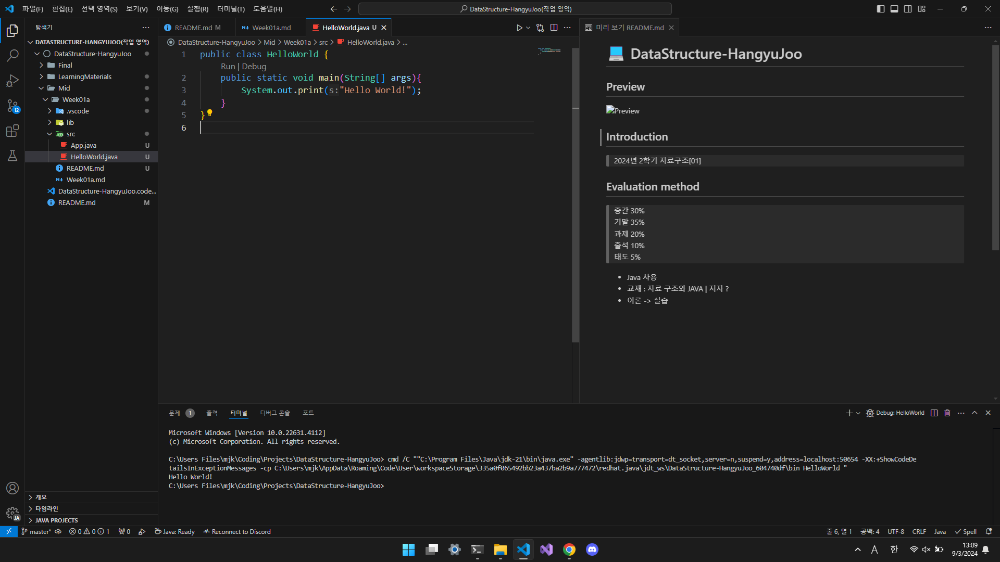

# 💻 DataStructure-HangyuJoo

## Preview

## Introduction

> 2024년 2학기 자료구조[01]

## Evaluation method

> 중간 30%  
> 기말 35%  
> 과제 20%  
> 출석 10%  
> 태도 5%  
>   
> 시험 문제에 정의에 대해서는 잘 안물어본다 -> 프로그래밍 능력을 본다(손코딩)  

- Java 사용
- 교재 : 자료 구조와 JAVA | 저자 ?
- 교재 1~6장 나감
- 이론 -> 실습
- A의 비율은 정해져 있지 않다